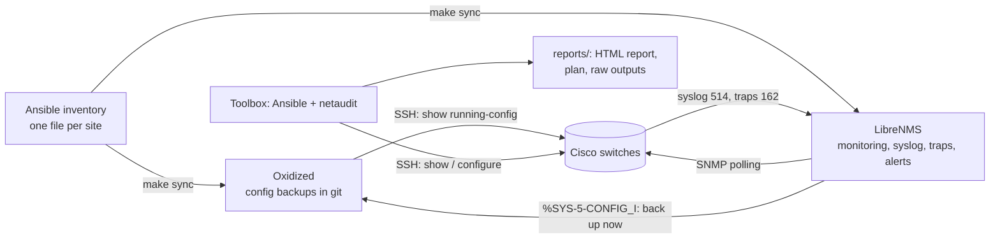

# switch-mgmt

Monitor and manage Cisco IOS / IOS-XE switches across several sites, all from
one Docker host:

* **LibreNMS** – monitoring, graphs, syslog, SNMP traps and alerting
  (with spanning-tree alert rules created for you).
* **Oxidized** – configuration backups in git. A switch is backed up within
  seconds of someone saving a change, and the diffs show on each device's
  *Config* tab in LibreNMS.
* **Ansible + netaudit** (the "toolbox") – a read-only spanning-tree audit with
  an HTML report, a remediation plan with the exact commands per switch, and a
  careful rollout: canary first, root bridges next, then batches, with backups
  and checks. It also pushes any other config snippet to every switch.
* **A lab** of six simulated switches with typical spanning-tree problems, so
  every step can be rehearsed safely.

The Ansible inventory (one file per site) is the single list of switches.
LibreNMS and Oxidized are filled from it.



---

## Contents

1. [Quick start](#quick-start)
2. [Deploy from a URL (Hostinger Docker Manager, Portainer...)](#deploy-from-a-url-hostinger-docker-manager-portainer)
3. [Try it on the lab first](#try-it-on-the-lab-first)
4. [Your first site: 50 switches with spanning-tree problems](#your-first-site-50-switches-with-spanning-tree-problems)
5. [Day-to-day commands](#day-to-day-commands)
6. [Several sites](#several-sites)
7. [Switch logins and security](#switch-logins-and-security)
8. [How changes are kept safe](#how-changes-are-kept-safe)
9. [Settings](#settings)
10. [Moving, backing up and upgrading](#moving-backing-up-and-upgrading)
11. [Troubleshooting](#troubleshooting)
12. [Repository layout and development](#repository-layout-and-development)

The spanning-tree background (what each finding means and how to fix it by
hand) is in [docs/stp-runbook.md](docs/stp-runbook.md).

---

## Quick start

**You need** a Linux host with Docker Engine and the Compose plugin
(Docker 24 or newer), `make` and `git`. 2 vCPU, 4 GB RAM and 20 GB of disk
are plenty for a few hundred switches. The switches must reach the host on
UDP/TCP 514 (syslog) and UDP/TCP 162 (traps). The host must reach the switches
on TCP 22 (SSH) and UDP 161 (SNMP).

```bash
git clone <this repository> switch-mgmt && cd switch-mgmt
make init            # creates .env (random database password) and the data directories
$EDITOR .env         # switch login, SNMP community, MONITORING_HOST = this host's IP
make up              # LibreNMS on http://<host>:8000, Oxidized, syslog and trap receivers
make librenms-admin  # create the LibreNMS admin account
make librenms-token  # create an API token for the toolbox (stored in .env)
make build           # build the toolbox image (Ansible + netaudit)
```

Run `make` on its own to list every command.

The settings that matter in `.env`:

| Variable | What it is |
| --- | --- |
| `NET_USERNAME`, `NET_PASSWORD` | Default SSH login for Ansible, discovery and Oxidized. Switches with other logins: see [Switch logins](#switch-logins-and-security) |
| `NET_ENABLE_SECRET` | Only if the account lands at `>`; leave empty for privilege-15/TACACS accounts |
| `SNMP_VERSION`, `SNMP_COMMUNITY` (or `SNMP_V3_*`) | What the switches get configured with and LibreNMS polls with |
| `MONITORING_HOST` | IP of this host as the switches see it: syslog and traps are sent there |
| `LIBRENMS_ADMIN_USER`, `LIBRENMS_ADMIN_PASSWORD` | First LibreNMS account (`make librenms-admin`) |
| `TZ`, `PUID`, `PGID` | Time zone, and your user/group IDs so that reports and backups belong to you |

`.env` is git-ignored. Keep it out of version control and readable only by you
(`make init` sets mode 600).

No checkout on the Docker host, or a VPS managed through a control panel? See
[Deploy from a URL](#deploy-from-a-url-hostinger-docker-manager-portainer).

---

## Deploy from a URL (Hostinger Docker Manager, Portainer...)

The same stack can run from a single compose file with nothing checked out,
the way Docker control panels deploy things:

```
https://raw.githubusercontent.com/agoodley/switch-mgmt/main/compose.hosted.yaml
```

`compose.hosted.yaml` pulls the toolbox image that CI publishes
(`ghcr.io/agoodley/switch-mgmt-toolbox:latest`) instead of building it, keeps
all state in named Docker volumes instead of `./data`, serves LibreNMS over
HTTPS only, and runs the toolbox permanently so you can execute commands in
it. Everything else (LibreNMS, Oxidized, the audit, the plan, the rollout,
the lab) is identical.

**If this repository is private**, the panel cannot fetch that URL (it
returns 404 without a login). Choose *Compose manually* instead and paste the
contents of `compose.hosted.yaml`; the file is self-contained. Making the
repository public is the other option.

**Before the first deployment**, the image must be pullable without a login:
on GitHub open the repository's *Packages* → `switch-mgmt-toolbox` → *Package
settings* → *Change visibility* → *Public*. A package can be public while the
repository stays private; this is a one-time step. The alternative is
`docker login ghcr.io` on the host with a token that has `read:packages`.
The `latest` tag exists once a CI run on `main` (or the default branch) has
passed; until then use a `sha-<commit>` tag through `TOOLBOX_IMAGE`.

### In the panel

1. *Docker Manager* → *Compose* → *Compose from URL*, paste the URL above (or
   *Compose manually* and paste the file), and name the project (the examples
   below use `switch-mgmt`).
2. Add the environment variables. They are the ones from `.env.example`.
   Some panels (Hostinger's among them) pre-fill the form from that file:
   delete rows whose name starts with `#`, and replace every `change-me`
   placeholder with a real value before deploying.

   | Variable | What |
   | --- | --- |
   | `LIBRENMS_DB_PASSWORD` | Required. Any long random string |
   | `NET_USERNAME`, `NET_PASSWORD`, `NET_ENABLE_SECRET` | Default switch login |
   | `SNMP_COMMUNITY` (or `SNMP_VERSION=v3` and `SNMP_V3_*`) | SNMP for LibreNMS |
   | `MONITORING_HOST` | This host's address as the switches see it |
   | `LIBRENMS_HTTPS_HOST` | Required. The name or IP you will browse to (`203.0.113.5`, `librenms.example.net`; several: comma-separated). The certificate is issued for it |
   | `LIBRENMS_HTTPS_PORT` | `443` by default; e.g. `8443` if the host already uses 443 |
   | `TZ` | Time zone |
   | `COMPOSE_PROFILES` | Optional: `lab` for the simulated switches |
   | `LIBRENMS_HTTP_PORT`, `SYSLOG_BIND`, `SNMPTRAP_BIND` | Only if 8000, 514 or 162 are already taken on the host |

3. Deploy. The one-shot `init` container seeds the volumes and exits; LibreNMS
   is on `https://<LIBRENMS_HTTPS_HOST>` (plus `:<port>` if you changed it)
   after a minute or two. **HTTPS only:** the certificate comes from Caddy's
   own certificate authority, so browsers warn until you trust its root
   certificate once (import it, or distribute it by group policy):

   ```bash
   docker cp switch-mgmt-https-1:/data/caddy/pki/authorities/local/root.crt librenms-ca.crt
   ```

   Plain HTTP is not exposed; it only listens on the host's `127.0.0.1:8000`,
   reachable through an SSH tunnel (`ssh -L 8000:127.0.0.1:8000 <host>`).
4. Create the LibreNMS admin and an API token (the panel's container terminal
   on `librenms`, or SSH to the host):

   ```bash
   docker exec -it switch-mgmt-librenms-1 lnms user:add --role=admin admin
   docker exec -it switch-mgmt-librenms-1 lnms api:token-create admin --name switch-mgmt
   ```

   Put the token in the stack's environment as `LIBRENMS_API_TOKEN` and
   redeploy, so `switch-mgmt sync` can use it.

### Running commands

Open the container terminal of `toolbox` in the panel, or
`docker exec -it switch-mgmt-toolbox-1 bash`. Inside, `switch-mgmt` replaces
`make`, with the same commands and variables as everywhere in this README;
on its own it lists them:

```bash
switch-mgmt discover SITE=hq SEED=10.10.0.1
nano ansible/inventory/sites/hq.yml          # set stp_role on the two roots
switch-mgmt monitoring SITE=hq CHECK=1
switch-mgmt sync
switch-mgmt audit SITE=hq
switch-mgmt plan SITE=hq
switch-mgmt apply SITE=hq
```

They can also be run directly from the host: `docker exec -it
switch-mgmt-toolbox-1 switch-mgmt audit SITE=hq`. Commands that start or stop
containers (`up`, `down`, `build`, `lab-up`, `lab-reset`...) belong to the
panel and say so.

* **Per-switch logins:** `nano ansible/inventory/credentials.yml` inside the
  toolbox, or copy a spreadsheet export in and import it:
  `docker cp passwords.csv switch-mgmt-toolbox-1:/tmp/` then
  `switch-mgmt credentials-import CSV=/tmp/passwords.csv`.
* **Reports:** `switch-mgmt report` prints where the latest one is. To open
  it on your computer: `docker cp -L switch-mgmt-toolbox-1:/work/reports/latest ./report`
  and open `report/report.html`. `report.md` is readable in the terminal.
* **The lab:** with `COMPOSE_PROFILES=lab`, `switch-mgmt lab-audit`,
  `lab-plan` and `lab-apply` work as described below. Restarting the `lab`
  container resets it to its broken starting point.

### Where the data is

Named volumes, prefixed with the project name (`switch-mgmt_inventory`,
`switch-mgmt_librenms`, ...): `db` and `librenms` (LibreNMS), `oxidized`
(config history), `oxidized-conf` (device list with logins), `ssh` (the
switches' host keys), `inventory`, `reports`, `backups`. Back them up like any
Docker volume, for example
`docker run --rm -v switch-mgmt_inventory:/v -v "$PWD":/out alpine tar czf /out/inventory.tgz -C /v .`.
The stack's environment variables hold the passwords; keep a copy of them too.

**Updating:** CI publishes a new `latest` image on every change; redeploy
(or *pull and recreate*) in the panel to pick it up. Image versions of
LibreNMS and Oxidized are pinned in the file and overridable with
`LIBRENMS_VERSION` / `OXIDIZED_VERSION`, as in `.env`.

**On a public VPS:** LibreNMS answers on HTTPS only, but it is still a login
page on the internet: restrict its port to your addresses in the provider's
firewall (Docker's published ports bypass `ufw`). The switches' management
networks are normally private, so
the host needs a VPN into each site (WireGuard to the site firewall, Tailscale
with a subnet router...): SSH and SNMP towards the switches, syslog and traps
back, all through the tunnel. `MONITORING_HOST` is then the host's tunnel
address. Never expose switch SSH to the internet.

---

## Try it on the lab first

The lab runs six fake switches (two Catalyst 9300 cores, three 2960-X, and one
old 2960 on IOS 12.2 that only speaks legacy SSH). Their configuration and
show output look like the real thing, and spanning tree is recalculated from
their running-config, so changes have visible effects. They come with the
problems a network that grew without an STP design usually has:

* every switch has the default priority, so the oldest access switch is the
  root bridge;
* PVST+ and Rapid-PVST+ mixed;
* a PC on a port without PortFast that flaps every 90 seconds, causing a stream
  of topology changes;
* an unmanaged switch running STP behind a user port;
* a native-VLAN mismatch on a daisy-chained trunk, MAC flapping, and a port
  shut down by BPDU Guard;
* one switch (acc-04) with a login of its own, set in
  `ansible/inventory-lab/credentials.yml`.

```bash
make lab-up          # builds the toolbox if needed, starts the lab
make lab-audit       # read-only audit -> reports/latest/report.html
make lab-plan        # dry run: fresh audit + the exact commands per switch
make lab-apply       # apply: canary, root bridges, then the rest
make lab-audit       # the root bridge is now core-01 everywhere
make lab-reset       # back to the broken starting point
```

The lab is also what CI runs on every change, from a fresh checkout:
audit → plan → apply → audit, then it checks the result.

To try the monitoring side as well, sync the lab into LibreNMS and Oxidized:
`make sync INVENTORY=inventory-lab`. The fake switches don't answer SNMP, so
they are added as ping-only devices.

---

## Your first site: 50 switches with spanning-tree problems

### 1. Logins

If every switch accepts the account in `.env`, there is nothing to do. If the
passwords differ from switch to switch, list them in
`ansible/inventory/credentials.yml` first, by switch name or management
address. From a spreadsheet export it is one command:
`make credentials-import CSV=passwords.csv`. See
[Switch logins and security](#switch-logins-and-security).

### 2. Build the inventory

Let CDP find the switches, starting from one (or two) you know:

```bash
make discover SITE=hq SEED=10.10.0.1            # writes ansible/inventory/sites/hq.yml
make discover SITE=hq SEED=10.10.0.1 SEED2=10.10.0.2
```

The crawler logs in with the login from `.env`, or the switch's own entry in
`credentials.yml`, and follows every CDP neighbour that is a switch. Phones and
access points are skipped. Read the generated file:

* switches it could not log into are listed at the bottom; fix and re-run, or
  add them by hand;
* **set `stp_role`** on the two switches that should be the root bridges. The
  two best-connected switches are suggested as commented-out lines:

```yaml
switches:
  children:
    hq:
      vars:
        site: hq
      hosts:
        hq-core-01:
          ansible_host: 10.10.0.1
          stp_role: root_primary      # priority 4096
        hq-core-02:
          ansible_host: 10.10.0.2
          stp_role: root_secondary    # priority 8192
        hq-acc-01:
          ansible_host: 10.10.0.11
```

You can also write the file by hand; see
`ansible/inventory/sites/example.yml.sample`.

### 3. Point the switches at the monitoring host

```bash
make monitoring SITE=hq CHECK=1   # shows the commands, changes nothing
make monitoring SITE=hq           # logging host, SNMP, traps, timestamps
```

If the switches have a management SVI, set `logging_source_interface` and
`snmp_trap_source` (for example `Vlan99`) in the site's `vars:`. LibreNMS then
always recognises the sender.

### 4. Fill LibreNMS and Oxidized

```bash
make sync
```

This adds every switch to LibreNMS (SNMP credentials from `.env`) in a device
group `site-hq`, and creates five alert rules: MAC flapping, BPDU Guard / Root
Guard / Loop Guard blocks, other STP inconsistencies, root bridge changes and
err-disabled ports. It also records the switches' SSH host keys, writes
Oxidized's device list with each switch's login, and reloads Oxidized.

LibreNMS sends alerts only after you add an **alert transport** (e-mail,
Teams, Slack...) under *Alerts → Alert Transports*.

### 5. Audit

```bash
make audit SITE=hq
```

The audit is read-only. It runs 14 show commands per switch and writes
`reports/<run>/report.html` (also reachable as `reports/latest/report.html`).
The report has:

* **Root bridges per VLAN**: who is root, whether that is the switch you chose,
  whether all switches agree, and who would take over if the root failed;
* **Topology-change sources**: where the topology-change counters point,
  followed switch by switch to the port that causes them, usually an access
  port without PortFast;
* **STP tree diagrams** for the busiest VLANs, with blocked links;
* edge ports without PortFast / BPDU Guard, unmanaged switches behind access
  ports, err-disabled and inconsistent ports, native-VLAN and allowed-VLAN
  mismatches, MAC flapping and other log messages, mixed STP modes, the PVST
  instance count against the platform limit;
* **the remediation plan** and a list of things that need a person (cabling,
  a rogue switch...).

Everything collected is kept under `reports/<run>/raw/` (one text file per
command per switch), so you can grep it later. Passwords, keys and SNMP
communities in it are replaced with `<secret hidden>`.

### 6. Plan

```bash
make plan SITE=hq
```

`make plan` runs a fresh audit and shows, for every switch and in rollout
order, the exact commands that would be sent. Nothing is changed. The plan
does the following:

* sets the bridge priority from `stp_role` (4096 / 8192; other switches are
  left alone unless you set `stp_priority_other`);
* moves PVST+ switches to Rapid-PVST+ (`stp_mode`);
* enables PortFast and BPDU Guard on access ports. It skips any port that has
  received BPDUs, has a switch behind it in CDP/LLDP, or holds a root or
  alternate role;
* enables err-disable recovery for BPDU Guard (300 s);
* optionally adds Loop Guard (`stp_loopguard_default`), Root Guard on the
  cores' downlinks (`stp_rootguard_downlinks`) and a path-cost method
  (`stp_pathcost_method`).

The plan stops for a person when something is unsafe to automate: a switch
running MST, or another switch with a priority that would beat the new root.
Policy is set in the inventory; see [Settings](#settings).

### 7. Apply

Do this in a maintenance window. Changing the mode or the root bridge makes
spanning tree reconverge (a few seconds with Rapid-PVST+, up to 50 s on
switches still running PVST+).

```bash
make apply SITE=hq
```

The rollout order is one access switch as a canary, then the primary root,
then the secondary, then the rest in batches of five, waiting for Enter
between batches. Each switch is backed up first, gets the non-disruptive
lines, then the mode and priority lines, and must still have its uplinks up
and no new err-disabled ports before its config is saved. The first failure
stops the whole rollout; see [How changes are kept safe](#how-changes-are-kept-safe).

### 8. Check the result

```bash
make audit SITE=hq          # straight away: roots, modes, edge ports
make audit SITE=hq          # again a few hours later
```

When the previous run is at least 30 minutes old, the audit compares the
topology-change counters with it, so it can show whether the changes have
stopped. Then work through the items the plan does not touch, listed under
*Manual actions* in the report: unmanaged switches behind user ports,
native-VLAN mismatches, err-disabled ports and so on.
[docs/stp-runbook.md](docs/stp-runbook.md) explains each one.

---

## Day-to-day commands

| Command | What it does |
| --- | --- |
| `make show CMD="show spanning-tree root" SITE=hq` | Run a show command everywhere; output in `reports/show/<time>-<command>/` |
| `make deploy SNIPPET=snippets/examples/udld-uplinks.cfg.j2 SITE=hq CHECK=1` | Dry run of a config snippet (Jinja2 template), then the same without `CHECK=1` to apply |
| `make backup` | Save every running-config to `backups/<site>/` now (Oxidized also does this hourly) |
| `make audit` / `make plan` / `make apply` | As above, for all sites when `SITE` is omitted |
| `make sync` | After adding or removing switches in the inventory |
| `make credentials-import CSV=passwords.csv` | Add per-switch logins from a spreadsheet export |
| `make forget-host HOST=10.10.0.7` | Accept the new SSH host key of a replaced switch |
| `make ps`, `make logs SERVICE=oxidized` | Container status and logs |
| `make shell` | A shell in the toolbox, with `ansible-playbook` and `netaudit` |

`SITE` takes any Ansible pattern: a site (`hq`), a switch (`hq-acc-07`) or a
list (`hq-acc-0*`). Snippets are described in
[ansible/snippets/README.md](ansible/snippets/README.md).

Config history lives on each device's *Config* tab in LibreNMS. The Oxidized
web UI has no login, so it only listens on `127.0.0.1:8888`. Open it through
an SSH tunnel: `ssh -L 8888:127.0.0.1:8888 <host>`.

---

## Several sites

* One inventory file per site in `ansible/inventory/sites/<site>.yml`, each a
  group under `switches` with `site: <site>` in its `vars:`.
* Settings for all sites go in `ansible/inventory/group_vars/switches.yml`.
  Per-site overrides go in the site file's `vars:`, per-switch ones in
  `ansible/inventory/host_vars/<switch>.yml`.
* `SITE=<site>` limits every command. Root bridges, plans and reports are
  worked out per site.
* LibreNMS gets one device group per site (`site-<site>`, location = site).
  Oxidized groups the backups by site.
* A remote site only needs SSH and SNMP from this host, and syslog/traps back
  to it. If a site sends syslog to a different address (NAT, a relay), set
  `monitoring_host` in that site's `vars:`.

---

## Switch logins and security

### Where the switch logins go

| File | What |
| --- | --- |
| `.env` | The default login: `NET_USERNAME`, `NET_PASSWORD`, `NET_ENABLE_SECRET` |
| `ansible/inventory/credentials.yml` | Switches or sites with a different login (git-ignored) |

Ansible, Oxidized and discovery all follow the same rules. A switch's own
entry beats its site's entry, which beats `.env`, and whatever an entry leaves
out comes from the next level. Keys are inventory names, management addresses
or site names:

```yaml
hq-acc-01:                    # by inventory name
  password: 'Uniq#ue-pass-1'
10.10.0.13:                   # by management address
  username: 'admin'
  password: 'other-pass'
  enable: 'its-enable-secret' # only if this login lands at the '>' prompt
branch1:                      # every switch of the branch1 site
  username: 'branchadmin'
  password: 'branch-pass'
```

Start from `ansible/inventory/credentials.yml.sample`. Put every value in
single quotes. A mistake such as an unquoted `0123`, which YAML reads as the
number 83, stops the run with a message rather than trying a wrong password.

**From a spreadsheet.** Save the passwords as CSV in this directory, with a
header row naming the columns `switch`, `username`, `password` and/or
`enable`. Comma- or semicolon-separated both work. Then:

```bash
make credentials-import CSV=passwords.csv   # adds to or updates credentials.yml
rm passwords.csv
```

Discovery uses the file too. It matches neighbours by their CDP name, and the
seed switch by the address or name you give in `SEED`.

**Encrypting the file.** `ansible-vault encrypt ansible/inventory/credentials.yml`
works; add `ARGS=--ask-vault-pass` to the make commands. It protects copies of
the file, but Oxidized still needs the passwords in `oxidized/router.json`,
and discovery cannot read an encrypted file.

**The long-term fix** for "every switch has its own password" is TACACS+ or
RADIUS (ISE, ClearPass, NPS, FreeRADIUS...). That gives you one automation
account that works everywhere and can be disabled in one place, plus personal
accounts for people. The unique local passwords then stay only as the
break-glass fallback, and `.env` is all this project needs. `make deploy` can
roll out the AAA configuration as a snippet. Try it on one switch first, with
console access at hand.

### What protects the credentials

* `.env`, `credentials.yml`, `oxidized/router.json` and Oxidized's generated
  config are readable by their owner only. Anyone with root or Docker access
  on this host can still read them, so keep the host dedicated to this job and
  limit who can log in.
* Saved output does not contain secrets. Passwords, keys and SNMP communities
  are replaced with `<secret hidden>` in the audit's raw files and in
  `make show` files, as Oxidized does in its backups. The pre-change backups in
  `backups/` stay complete, so they can be restored. Everything the toolbox
  writes is readable by you only.
* **SSH host keys are checked**, trust on first use. The first time a switch
  is contacted, its key is recorded in `data/ssh/known_hosts`. From then on
  Ansible and Oxidized refuse to log in to anything that presents a different
  key, so a device posing as a switch never receives a password. After
  replacing a switch, accept its new key with `make forget-host HOST=<address>`.
* The Oxidized web UI and API (port 8888) have no login and listen on
  localhost only. The API shows the enable secret of a switch that has its
  own in `credentials.yml`. Accounts at privilege 15 need no enable secret.
* On the switches, allow SSH only from this host and your admin networks
  (`access-class` on the vty lines), and prefer SNMPv3 (`SNMP_VERSION=v3`).

### HTTPS for LibreNMS

LibreNMS serves plain HTTP on port 8000. To put HTTPS in front of it, set in `.env`:

```bash
COMPOSE_FILE=compose.yaml:compose.https.yaml
LIBRENMS_HTTPS_HOST=librenms.example.net   # the name users browse to
LIBRENMS_HTTP_BIND=127.0.0.1               # plain HTTP from this host only
```

Then run `make up`. Caddy serves `https://librenms.example.net` with a
certificate from its own CA. To trust that CA once in your browsers (or by
group policy), export it with
`docker compose exec -T https cat /data/caddy/pki/authorities/local/root.crt > librenms-ca.crt`.

If you already run a reverse proxy, point it at port 8000 instead, and add
`APP_TRUSTED_PROXIES=<its address>` to `data/librenms/.env` so that LibreNMS
builds `https://` links.

---

## How changes are kept safe

* `make audit` and `make plan` never change anything.
* `make apply` always plans from a fresh audit, never from an old report.
* Every switch is backed up to `backups/<site>/` before it is touched. Oxidized
  keeps the full history as well.
* Lines that do not make spanning tree recalculate (edge ports, err-disable
  recovery) go first. Mode, priority and path-cost changes go last, with a
  longer timeout.
* After each switch: its uplinks must still be up and no port may have become
  err-disabled. Only then is the config saved (`write memory`). A failed
  switch keeps an unsaved running-config, so a reload restores the old one.
* The first failure stops the rollout and prints the rollback commands and the
  backup path. With `stp_auto_rollback: true` the rollback is pushed
  automatically. Ports that BPDU Guard shut down during the change are then
  re-enabled.
* Ports the plan never touches: ports that have received BPDUs, ports with a
  switch behind them in CDP/LLDP, ports in a root or alternate role, trunks
  (unless listed in `stp_edge_trunks`), and anything in `stp_edge_exclude`.

---

## Settings

All defaults, with comments, are in
[`ansible/roles/switch_mgmt_defaults/defaults/main.yml`](ansible/roles/switch_mgmt_defaults/defaults/main.yml).
Override them in the inventory (all sites, per site or per switch). The most
used ones:

| Setting | Default | Meaning |
| --- | --- | --- |
| `stp_role` | `access` | `root_primary`, `root_secondary` or `access` |
| `stp_mode` | `rapid-pvst` | Mode every switch should run (`pvst`, `rapid-pvst`, or `""` to leave alone) |
| `stp_priority_root_primary` / `_secondary` | `4096` / `8192` | Priorities for the two roots |
| `stp_priority_other` | `""` | Set `61440` so an access switch can never win, even with both cores down |
| `stp_priority` | – | Explicit priority for one switch (host_vars), wins over the role |
| `stp_edge_portfast`, `stp_edge_bpduguard` | `true` | Harden access ports |
| `stp_portfast_command` | `spanning-tree portfast` | Use `spanning-tree portfast edge` if a platform requires it |
| `stp_edge_exclude` | `[]` | Ports to leave alone, e.g. `[Gi1/0/24]` |
| `stp_edge_trunks` | `[]` | Trunks to servers/hypervisors that should get `portfast trunk` |
| `stp_errdisable_recovery` / `_interval` | `true` / `300` | Automatic recovery of ports shut by BPDU Guard |
| `stp_loopguard_default`, `stp_rootguard_downlinks` | `false` | Extra protections (see the runbook) |
| `apply_batches` | `[1, 1, 1, 5]` | Rollout batch sizes; the last value repeats |
| `confirm_batches` | `true` | Wait for Enter between batches |
| `stp_auto_rollback` | `false` | Push the rollback automatically when a post-check fails |
| `switch_mgmt_check_host_keys` | `true` | Record new switches' SSH host keys and refuse changed ones |
| `logging_source_interface`, `snmp_trap_source` | `""` | Source interface for syslog and traps |
| `ntp_servers` | `[]` | NTP servers set by `make monitoring` |

---

## Moving, backing up and upgrading

Everything lives in this directory:

| Path | Contents |
| --- | --- |
| `.env` | Credentials and settings |
| `ansible/inventory/` | The switch inventory (commit it; `credentials.yml` in it is git-ignored) |
| `ansible/inventory/credentials.yml` | Per-switch logins |
| `data/db`, `data/librenms` | LibreNMS database, graphs, settings |
| `data/oxidized` | Oxidized's git repository of configs |
| `data/ssh` | The switches' SSH host keys |
| `reports/`, `backups/` | Audit reports and pre-change backups |

**Move to another host:** `make down`, then copy the directory with
permissions (`sudo tar -cpzf switch-mgmt.tgz switch-mgmt`), unpack it on the
new host and run `make up`. If the host's IP changes, update `MONITORING_HOST`
and run `make monitoring` so the switches send syslog and traps to the new
address.

**Back up** the directory, or at least `.env`, `ansible/inventory/` (with
`credentials.yml`) and `data/`. These hold passwords, so store the copies as
carefully as the host. For a consistent database copy while the stack runs, use
`docker compose exec -T db sh -c 'mariadb-dump -u librenms -p"$MYSQL_PASSWORD" librenms' > librenms.sql`.

**Upgrade:** image versions are pinned in `compose.yaml` and can be overridden
in `.env` (`LIBRENMS_VERSION`, `OXIDIZED_VERSION`). Change them, then run
`make pull && make up`. Rebuild the toolbox with `make build`. Settings in
`librenms/config/` apply only when the database is first created. After that,
change them in the LibreNMS web UI.

---

## Troubleshooting

**Ansible or discovery fails with `IncompatiblePeer` / `no acceptable kex algorithm` on old switches.**
Catalyst 2960/3560/3750 images on 12.2/15.0 only offer SHA-1 key exchanges and
`ssh-rsa` host keys, which paramiko 5 removed. The toolbox pins
`paramiko>=4,<5`. If you install the tools yourself, keep that pin.

**The LibreNMS web UI does not come up; the log says `socket() [::]:8000 failed (97: Address family not supported)`.**
The host has IPv6 disabled. Set `LIBRENMS_LISTEN_IPV6=false` in `.env` and run `make restart`.

**Syslog messages do not show up in LibreNMS.**
LibreNMS only stores messages from addresses it knows as a device. Set
`logging_source_interface` to the management SVI and run `make monitoring`.
If messages stop after the `syslogng` container was recreated, the host's
connection tracking is still sending the switches' UDP flow to the old
container. Run `sudo conntrack -D -p udp --dport 514` (conntrack-tools) or
restart Docker.

**Oxidized shows a node as failed, or LibreNMS has no Config tab.**
Check `make logs SERVICE=oxidized`. If the account needs `enable`, set
`NET_ENABLE_SECRET` (or `enable` in the switch's `credentials.yml` entry). Run
`make sync` after changing logins or renaming switches; it also records the
host keys of new switches, which Oxidized needs before it logs in.

**`host key mismatch for <address>`, or `make sync` reports `changed` keys.**
The switch presents a different SSH host key from the one recorded the first
time. That is expected after replacing a switch or regenerating its key
(`crypto key generate rsa`), and suspicious otherwise. If it is expected, run
`make forget-host HOST=<address>` (add `PORT=` for a port other than 22) for
the address in the message, then `make sync`.

**`credentials.yml: put the password of 'x' in quotes`** (or `unknown setting`).
Fix that entry; values must be quoted strings, and only `username`, `password`
and `enable` are allowed. A warning that the file **can be read by other
users** means it needs `chmod 600 ansible/inventory/credentials.yml`.

**`make sync-librenms` says the token is missing or invalid.** Run `make librenms-token`.

**Hosted deployment fails with `failed to bind host port ... address already in use`.**
Something on the host already uses that port. Pick another one in the stack's
environment: `LIBRENMS_HTTP_PORT` for 8000, `SYSLOG_BIND` / `SNMPTRAP_BIND` to
bind 514 and 162 to one address, `OXIDIZED_PORT` for 8888, `LIBRENMS_HTTPS_PORT`
for 443 (for example `8443`; then browse to `https://<host>:8443`).

**Hosted deployment: `pull access denied` / `denied` for `ghcr.io/agoodley/switch-mgmt-toolbox`.**
The package is private. Make it public once on GitHub (*Packages* →
`switch-mgmt-toolbox` → *Package settings* → *Change visibility*), or
`docker login ghcr.io` on the host with a token that can read packages.

**Building the toolbox fails with certificate errors behind a corporate proxy.**
Set `EXTRA_CA_CERT=/path/to/proxy-ca.pem` in `.env` and run `make build`.

**No alert e-mails.** The alert rules exist, but LibreNMS needs an alert
transport (*Alerts → Alert Transports*).

---

## Repository layout and development

```
compose.yaml              LibreNMS (+ dispatcher, syslog-ng, snmptrapd), MariaDB, Redis, Oxidized, toolbox, lab
compose.https.yaml        optional HTTPS front end for LibreNMS
compose.hosted.yaml       the same stack deployable from a URL (published toolbox image, named volumes)
Makefile                  every command (run `make`)
.env.example              settings template (copied to .env by `make init`)
ansible/
  inventory/              your switches: sites/<site>.yml, group_vars/, host_vars/,
                          credentials.yml (per-switch logins, from credentials.yml.sample)
  inventory-lab/          inventory for the simulated lab
  playbooks/              stp_audit, stp_remediate, deploy_snippet, show, backup,
                          monitoring_baseline, librenms_sync, oxidized_sync
  roles/                  switch_mgmt_defaults (all settings), netaudit_collect, stp_apply
  snippets/               config snippets for `make deploy`
  vars_plugins/           applies credentials.yml (+ tests in ansible/tests/)
netaudit/                 Python package: IOS parsers, STP analysis, planner, report,
                          CDP discovery, lab simulator (+ tests)
docker/                   toolbox Dockerfile and in-container commands (switch-mgmt, switch-mgmt-init),
                          Oxidized config template
librenms/config/          LibreNMS settings seeded on first start
lab/topology.yml          the simulated network
docs/stp-runbook.md       spanning-tree findings explained, manual fixes
```

Development:

```bash
make test                                  # unit tests (netaudit + Ansible plugin) in the toolbox image
cd netaudit && pip install -e ".[lab,discover,dev]" && pytest && ruff check src tests
yamllint . && (cd ansible && ansible-lint)
```

CI (`.github/workflows/ci.yml`, on every push) runs the linters and unit tests, then builds
the toolbox and runs the whole audit → plan → apply → audit cycle against the
lab, twice: with `compose.yaml` and inside the toolbox container of
`compose.hosted.yaml`. When that passes it publishes the toolbox image to
GitHub Container Registry (`latest` from `main` and the default branch, plus
the branch name and `sha-<commit>` tags).

Everything has been tested against the simulated lab and real IOS output
formats, not against your hardware. Run the read-only audit first, then
`make plan`, and apply to a single access switch (`SITE=<switch>`) before a
whole site.
