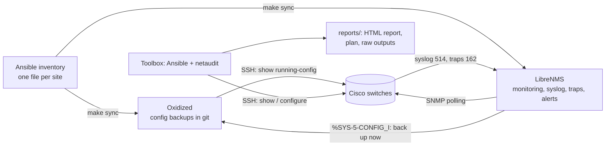

# switch-mgmt

Monitor and manage Cisco IOS / IOS-XE switches across several sites, all from
one Docker host:

* **LibreNMS** – monitoring, graphs, syslog, SNMP traps and alerting
  (with spanning-tree alert rules created for you).
* **Oxidized** – configuration backups in git. A switch is backed up within
  seconds of someone saving a change, and the diffs show on each device's
  *Config* tab in LibreNMS.
* **Ansible + netaudit** (the "toolbox") – a read-only spanning-tree audit with
  an HTML report, a remediation plan with the exact commands per switch, and a
  careful rollout: canary first, root bridges next, then batches, with backups
  and checks. It also pushes any other config snippet to every switch.
* **A lab** of six simulated switches with typical spanning-tree problems, so
  every step can be rehearsed safely.

The Ansible inventory (one file per site) is the single list of switches.
LibreNMS and Oxidized are filled from it.



---

## Contents

1. [Quick start](#quick-start)
2. [Try it on the lab first](#try-it-on-the-lab-first)
3. [Your first site: 50 switches with spanning-tree problems](#your-first-site-50-switches-with-spanning-tree-problems)
4. [Day-to-day commands](#day-to-day-commands)
5. [Several sites](#several-sites)
6. [How changes are kept safe](#how-changes-are-kept-safe)
7. [Settings](#settings)
8. [Moving, backing up and upgrading](#moving-backing-up-and-upgrading)
9. [Troubleshooting](#troubleshooting)
10. [Repository layout and development](#repository-layout-and-development)

The spanning-tree background (what each finding means and how to fix it by
hand) is in [docs/stp-runbook.md](docs/stp-runbook.md).

---

## Quick start

**You need** a Linux host with Docker Engine and the Compose plugin
(Docker 24 or newer), `make` and `git`. 2 vCPU, 4 GB RAM and 20 GB of disk
are plenty for a few hundred switches. The switches must reach the host on
UDP/TCP 514 (syslog) and UDP/TCP 162 (traps). The host must reach the switches
on TCP 22 (SSH) and UDP 161 (SNMP).

```bash
git clone <this repository> switch-mgmt && cd switch-mgmt
make init            # creates .env (random database password) and the data directories
$EDITOR .env         # switch login, SNMP community, MONITORING_HOST = this host's IP
make up              # LibreNMS on http://<host>:8000, Oxidized, syslog and trap receivers
make librenms-admin  # create the LibreNMS admin account
make librenms-token  # create an API token for the toolbox (stored in .env)
make build           # build the toolbox image (Ansible + netaudit)
```

Run `make` on its own to list every command.

The settings that matter in `.env`:

| Variable | What it is |
| --- | --- |
| `NET_USERNAME`, `NET_PASSWORD` | SSH login used by Ansible, discovery and Oxidized |
| `NET_ENABLE_SECRET` | Only if the account lands at `>`; leave empty for privilege-15/TACACS accounts |
| `SNMP_VERSION`, `SNMP_COMMUNITY` (or `SNMP_V3_*`) | What the switches get configured with and LibreNMS polls with |
| `MONITORING_HOST` | IP of this host as the switches see it: syslog and traps are sent there |
| `LIBRENMS_ADMIN_USER`, `LIBRENMS_ADMIN_PASSWORD` | First LibreNMS account (`make librenms-admin`) |
| `TZ`, `PUID`, `PGID` | Time zone, and your user/group IDs so that reports and backups belong to you |

`.env` is git-ignored. Keep it out of version control and readable only by you
(`make init` sets mode 600).

---

## Try it on the lab first

The lab runs six fake switches (two Catalyst 9300 cores, three 2960-X, and one
old 2960 on IOS 12.2 that only speaks legacy SSH). Their configuration and
show output look like the real thing, and spanning tree is recalculated from
their running-config, so changes have visible effects. They come with the
problems a network that grew without an STP design usually has:

* every switch has the default priority, so the oldest access switch is the
  root bridge;
* PVST+ and Rapid-PVST+ mixed;
* a PC on a port without PortFast that flaps every 90 seconds, causing a stream
  of topology changes;
* an unmanaged switch running STP behind a user port;
* a native-VLAN mismatch on a daisy-chained trunk, MAC flapping, and a port
  shut down by BPDU Guard.

```bash
make lab-up          # builds the toolbox if needed, starts the lab
make lab-audit       # read-only audit -> reports/latest/report.html
make lab-plan        # dry run: fresh audit + the exact commands per switch
make lab-apply       # apply: canary, root bridges, then the rest
make lab-audit       # the root bridge is now core-01 everywhere
make lab-reset       # back to the broken starting point
```

The lab is also what CI runs on every change, from a fresh checkout:
audit → plan → apply → audit, then it checks the result.

To try the monitoring side as well, sync the lab into LibreNMS and Oxidized:
`make sync INVENTORY=inventory-lab`. The fake switches don't answer SNMP, so
they are added as ping-only devices.

---

## Your first site: 50 switches with spanning-tree problems

### 1. Build the inventory

Let CDP find the switches, starting from one (or two) you know:

```bash
make discover SITE=hq SEED=10.10.0.1            # writes ansible/inventory/sites/hq.yml
make discover SITE=hq SEED=10.10.0.1 SEED2=10.10.0.2
```

The crawler logs in with `NET_USERNAME`/`NET_PASSWORD` and follows every CDP
neighbour that is a switch. Phones and access points are skipped. Read the
generated file:

* switches it could not log into are listed at the bottom; fix and re-run, or
  add them by hand;
* **set `stp_role`** on the two switches that should be the root bridges. The
  two best-connected switches are suggested as commented-out lines:

```yaml
switches:
  children:
    hq:
      vars:
        site: hq
      hosts:
        hq-core-01:
          ansible_host: 10.10.0.1
          stp_role: root_primary      # priority 4096
        hq-core-02:
          ansible_host: 10.10.0.2
          stp_role: root_secondary    # priority 8192
        hq-acc-01:
          ansible_host: 10.10.0.11
```

You can also write the file by hand; see
`ansible/inventory/sites/example.yml.sample`.

### 2. Point the switches at the monitoring host

```bash
make monitoring SITE=hq CHECK=1   # shows the commands, changes nothing
make monitoring SITE=hq           # logging host, SNMP, traps, timestamps
```

If the switches have a management SVI, set `logging_source_interface` and
`snmp_trap_source` (for example `Vlan99`) in the site's `vars:`. LibreNMS then
always recognises the sender.

### 3. Fill LibreNMS and Oxidized

```bash
make sync
```

This adds every switch to LibreNMS (SNMP credentials from `.env`) in a device
group `site-hq`, and creates five alert rules: MAC flapping, BPDU Guard / Root
Guard / Loop Guard blocks, other STP inconsistencies, root bridge changes and
err-disabled ports. It also writes Oxidized's device list and reloads it.

LibreNMS sends alerts only after you add an **alert transport** (e-mail,
Teams, Slack...) under *Alerts → Alert Transports*.

### 4. Audit

```bash
make audit SITE=hq
```

The audit is read-only. It runs 14 show commands per switch and writes
`reports/<run>/report.html` (also reachable as `reports/latest/report.html`).
The report has:

* **Root bridges per VLAN**: who is root, whether that is the switch you chose,
  whether all switches agree, and who would take over if the root failed;
* **Topology-change sources**: where the topology-change counters point,
  followed switch by switch to the port that causes them, usually an access
  port without PortFast;
* **STP tree diagrams** for the busiest VLANs, with blocked links;
* edge ports without PortFast / BPDU Guard, unmanaged switches behind access
  ports, err-disabled and inconsistent ports, native-VLAN and allowed-VLAN
  mismatches, MAC flapping and other log messages, mixed STP modes, the PVST
  instance count against the platform limit;
* **the remediation plan** and a list of things that need a person (cabling,
  a rogue switch...).

Everything collected is kept under `reports/<run>/raw/` (one text file per
command per switch), so you can grep it later.

### 5. Plan

```bash
make plan SITE=hq
```

`make plan` runs a fresh audit and shows, for every switch and in rollout
order, the exact commands that would be sent. Nothing is changed. The plan
does the following:

* sets the bridge priority from `stp_role` (4096 / 8192; other switches are
  left alone unless you set `stp_priority_other`);
* moves PVST+ switches to Rapid-PVST+ (`stp_mode`);
* enables PortFast and BPDU Guard on access ports. It skips any port that has
  received BPDUs, has a switch behind it in CDP/LLDP, or holds a root or
  alternate role;
* enables err-disable recovery for BPDU Guard (300 s);
* optionally adds Loop Guard (`stp_loopguard_default`), Root Guard on the
  cores' downlinks (`stp_rootguard_downlinks`) and a path-cost method
  (`stp_pathcost_method`).

The plan stops for a person when something is unsafe to automate: a switch
running MST, or another switch with a priority that would beat the new root.
Policy is set in the inventory; see [Settings](#settings).

### 6. Apply

Do this in a maintenance window. Changing the mode or the root bridge makes
spanning tree reconverge (a few seconds with Rapid-PVST+, up to 50 s on
switches still running PVST+).

```bash
make apply SITE=hq
```

The rollout order is one access switch as a canary, then the primary root,
then the secondary, then the rest in batches of five, waiting for Enter
between batches. Each switch is backed up first, gets the non-disruptive
lines, then the mode and priority lines, and must still have its uplinks up
and no new err-disabled ports before its config is saved. The first failure
stops the whole rollout; see [How changes are kept safe](#how-changes-are-kept-safe).

### 7. Check the result

```bash
make audit SITE=hq          # straight away: roots, modes, edge ports
make audit SITE=hq          # again a few hours later
```

When the previous run is at least 30 minutes old, the audit compares the
topology-change counters with it, so it can show whether the changes have
stopped. Then work through the items the plan does not touch, listed under
*Manual actions* in the report: unmanaged switches behind user ports,
native-VLAN mismatches, err-disabled ports and so on.
[docs/stp-runbook.md](docs/stp-runbook.md) explains each one.

---

## Day-to-day commands

| Command | What it does |
| --- | --- |
| `make show CMD="show spanning-tree root" SITE=hq` | Run a show command everywhere; output in `reports/show/<time>-<command>/` |
| `make deploy SNIPPET=snippets/examples/udld-uplinks.cfg.j2 SITE=hq CHECK=1` | Dry run of a config snippet (Jinja2 template), then the same without `CHECK=1` to apply |
| `make backup` | Save every running-config to `backups/<site>/` now (Oxidized also does this hourly) |
| `make audit` / `make plan` / `make apply` | As above, for all sites when `SITE` is omitted |
| `make sync` | After adding or removing switches in the inventory |
| `make ps`, `make logs SERVICE=oxidized` | Container status and logs |
| `make shell` | A shell in the toolbox, with `ansible-playbook` and `netaudit` |

`SITE` takes any Ansible pattern: a site (`hq`), a switch (`hq-acc-07`) or a
list (`hq-acc-0*`). Snippets are described in
[ansible/snippets/README.md](ansible/snippets/README.md).

Config history lives on each device's *Config* tab in LibreNMS. The Oxidized
web UI has no login, so it only listens on `127.0.0.1:8888`. Open it through
an SSH tunnel: `ssh -L 8888:127.0.0.1:8888 <host>`.

---

## Several sites

* One inventory file per site in `ansible/inventory/sites/<site>.yml`, each a
  group under `switches` with `site: <site>` in its `vars:`.
* Settings for all sites go in `ansible/inventory/group_vars/switches.yml`.
  Per-site overrides go in the site file's `vars:`, per-switch ones in
  `ansible/inventory/host_vars/<switch>.yml`.
* `SITE=<site>` limits every command. Root bridges, plans and reports are
  worked out per site.
* LibreNMS gets one device group per site (`site-<site>`, location = site).
  Oxidized groups the backups by site.
* A remote site only needs SSH and SNMP from this host, and syslog/traps back
  to it. If a site sends syslog to a different address (NAT, a relay), set
  `monitoring_host` in that site's `vars:`.

---

## How changes are kept safe

* `make audit` and `make plan` never change anything.
* `make apply` always plans from a fresh audit, never from an old report.
* Every switch is backed up to `backups/<site>/` before it is touched. Oxidized
  keeps the full history as well.
* Lines that do not make spanning tree recalculate (edge ports, err-disable
  recovery) go first. Mode, priority and path-cost changes go last, with a
  longer timeout.
* After each switch: its uplinks must still be up and no port may have become
  err-disabled. Only then is the config saved (`write memory`). A failed
  switch keeps an unsaved running-config, so a reload restores the old one.
* The first failure stops the rollout and prints the rollback commands and the
  backup path. With `stp_auto_rollback: true` the rollback is pushed
  automatically. Ports that BPDU Guard shut down during the change are then
  re-enabled.
* Ports the plan never touches: ports that have received BPDUs, ports with a
  switch behind them in CDP/LLDP, ports in a root or alternate role, trunks
  (unless listed in `stp_edge_trunks`), and anything in `stp_edge_exclude`.

---

## Settings

All defaults, with comments, are in
[`ansible/roles/switch_mgmt_defaults/defaults/main.yml`](ansible/roles/switch_mgmt_defaults/defaults/main.yml).
Override them in the inventory (all sites, per site or per switch). The most
used ones:

| Setting | Default | Meaning |
| --- | --- | --- |
| `stp_role` | `access` | `root_primary`, `root_secondary` or `access` |
| `stp_mode` | `rapid-pvst` | Mode every switch should run (`pvst`, `rapid-pvst`, or `""` to leave alone) |
| `stp_priority_root_primary` / `_secondary` | `4096` / `8192` | Priorities for the two roots |
| `stp_priority_other` | `""` | Set `61440` so an access switch can never win, even with both cores down |
| `stp_priority` | – | Explicit priority for one switch (host_vars), wins over the role |
| `stp_edge_portfast`, `stp_edge_bpduguard` | `true` | Harden access ports |
| `stp_portfast_command` | `spanning-tree portfast` | Use `spanning-tree portfast edge` if a platform requires it |
| `stp_edge_exclude` | `[]` | Ports to leave alone, e.g. `[Gi1/0/24]` |
| `stp_edge_trunks` | `[]` | Trunks to servers/hypervisors that should get `portfast trunk` |
| `stp_errdisable_recovery` / `_interval` | `true` / `300` | Automatic recovery of ports shut by BPDU Guard |
| `stp_loopguard_default`, `stp_rootguard_downlinks` | `false` | Extra protections (see the runbook) |
| `apply_batches` | `[1, 1, 1, 5]` | Rollout batch sizes; the last value repeats |
| `confirm_batches` | `true` | Wait for Enter between batches |
| `stp_auto_rollback` | `false` | Push the rollback automatically when a post-check fails |
| `logging_source_interface`, `snmp_trap_source` | `""` | Source interface for syslog and traps |
| `ntp_servers` | `[]` | NTP servers set by `make monitoring` |

---

## Moving, backing up and upgrading

Everything lives in this directory:

| Path | Contents |
| --- | --- |
| `.env` | Credentials and settings |
| `ansible/inventory/` | The switch inventory (commit it, but never `.env`) |
| `data/db`, `data/librenms` | LibreNMS database, graphs, settings |
| `data/oxidized` | Oxidized's git repository of configs |
| `reports/`, `backups/` | Audit reports and pre-change backups |

**Move to another host:** `make down`, then copy the directory with
permissions (`sudo tar -cpzf switch-mgmt.tgz switch-mgmt`), unpack it on the
new host and run `make up`. If the host's IP changes, update `MONITORING_HOST`
and run `make monitoring` so the switches send syslog and traps to the new
address.

**Back up** the directory, or at least `.env`, `ansible/inventory/` and
`data/`. For a consistent database copy while the stack runs, use
`docker compose exec -T db sh -c 'mariadb-dump -u librenms -p"$MYSQL_PASSWORD" librenms' > librenms.sql`.

**Upgrade:** image versions are pinned in `compose.yaml` and can be overridden
in `.env` (`LIBRENMS_VERSION`, `OXIDIZED_VERSION`). Change them, then run
`make pull && make up`. Rebuild the toolbox with `make build`. Settings in
`librenms/config/` apply only when the database is first created. After that,
change them in the LibreNMS web UI.

---

## Troubleshooting

**Ansible or discovery fails with `IncompatiblePeer` / `no acceptable kex algorithm` on old switches.**
Catalyst 2960/3560/3750 images on 12.2/15.0 only offer SHA-1 key exchanges and
`ssh-rsa` host keys, which paramiko 5 removed. The toolbox pins
`paramiko>=4,<5`. If you install the tools yourself, keep that pin.

**The LibreNMS web UI does not come up; the log says `socket() [::]:8000 failed (97: Address family not supported)`.**
The host has IPv6 disabled. Set `LIBRENMS_LISTEN_IPV6=false` in `.env` and run `make restart`.

**Syslog messages do not show up in LibreNMS.**
LibreNMS only stores messages from addresses it knows as a device. Set
`logging_source_interface` to the management SVI and run `make monitoring`.
If messages stop after the `syslogng` container was recreated, the host's
connection tracking is still sending the switches' UDP flow to the old
container. Run `sudo conntrack -D -p udp --dport 514` (conntrack-tools) or
restart Docker.

**Oxidized shows a node as failed, or LibreNMS has no Config tab.**
Check `make logs SERVICE=oxidized`. If your account needs `enable`, set
`NET_ENABLE_SECRET`. Node names come from the inventory, so run `make sync`
after renaming switches.

**`make sync-librenms` says the token is missing or invalid.** Run `make librenms-token`.

**Building the toolbox fails with certificate errors behind a corporate proxy.**
Set `EXTRA_CA_CERT=/path/to/proxy-ca.pem` in `.env` and run `make build`.

**Host keys.** The toolbox accepts each switch's SSH host key on first contact
and does not keep them between runs (`host_key_checking = False`), which suits
networks where switches get replaced. For strict checking, set
`host_key_checking = True` in `ansible/ansible.cfg` and mount a maintained
`known_hosts` into the toolbox.

**No alert e-mails.** The alert rules exist, but LibreNMS needs an alert
transport (*Alerts → Alert Transports*).

---

## Repository layout and development

```
compose.yaml              LibreNMS (+ dispatcher, syslog-ng, snmptrapd), MariaDB, Redis, Oxidized, toolbox, lab
Makefile                  every command (run `make`)
.env.example              settings template (copied to .env by `make init`)
ansible/
  inventory/              your switches: sites/<site>.yml, group_vars/, host_vars/
  inventory-lab/          inventory for the simulated lab
  playbooks/              stp_audit, stp_remediate, deploy_snippet, show, backup,
                          monitoring_baseline, librenms_sync, oxidized_sync
  roles/                  switch_mgmt_defaults (all settings), netaudit_collect, stp_apply
  snippets/               config snippets for `make deploy`
netaudit/                 Python package: IOS parsers, STP analysis, planner, report,
                          CDP discovery, lab simulator (+ tests)
docker/                   toolbox Dockerfile, Oxidized config template
librenms/config/          LibreNMS settings seeded on first start
lab/topology.yml          the simulated network
docs/stp-runbook.md       spanning-tree findings explained, manual fixes
```

Development:

```bash
make test                                  # unit tests in the toolbox image
cd netaudit && pip install -e ".[lab,discover,dev]" && pytest && ruff check src tests
yamllint . && (cd ansible && ansible-lint)
```

CI (`.github/workflows/ci.yml`, on every push) runs the linters and unit tests, then builds
the toolbox and runs the whole audit → plan → apply → audit cycle against the
lab.

Everything has been tested against the simulated lab and real IOS output
formats, not against your hardware. Run the read-only audit first, then
`make plan`, and apply to a single access switch (`SITE=<switch>`) before a
whole site.
